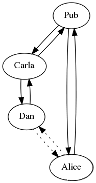

# Gossip

## Following 

Users choose which feeds to synchronize by following them. Presently, Scuttlebot's replicate plugin, which is enabled by default, looks on the master user's feed for `type: contact` messages to know which users are currently followed.

## Replication

Since feeds are append-only, replication is simple: request all messages in the feed that are newer than the latest message you know about. Scuttlebot maintains a table of known peers, which it cycles through, asking for updates for all followed feeds.

Since feeds are append-only, gossip is simple: request all messages in the feed that are newer than the latest message you know about. Scuttlebot maintains a table of known peers, which it cycles through, asking for updates for all followed feeds.

## Network

The protocol creates a [global gossip network](https://en.wikipedia.org/wiki/Gossip_protocol). This means that information is able to distribute across multiple machines, without requiring direct connections between them.

Even though Alice and Dan lack a direct connection, they can still exchange feeds:

This is because gossip creates "transitive" connections between computers. Dan's messages travel through Carla and the Pub to reach Alice, and visa-versa.
