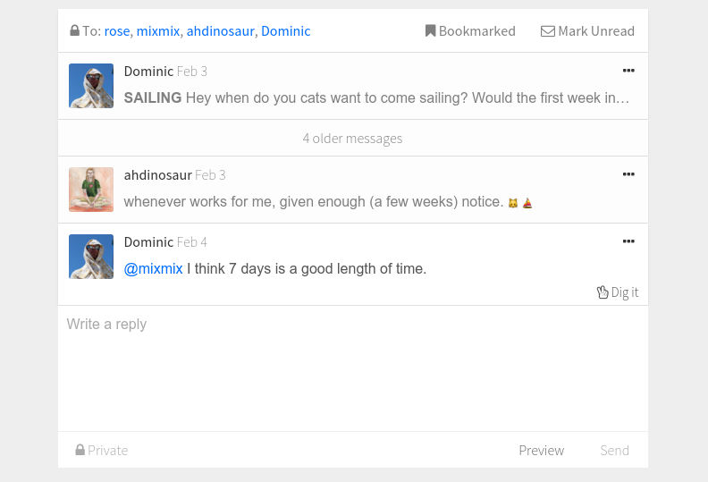
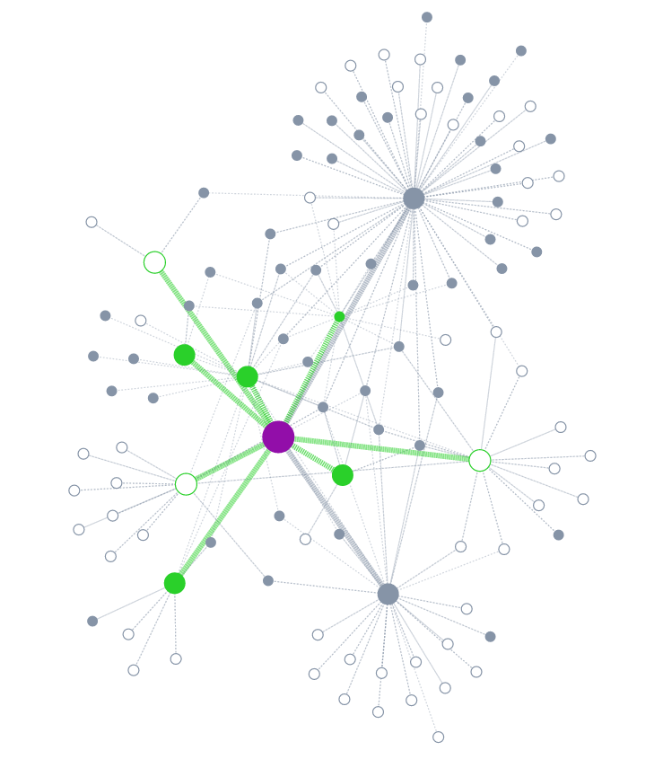

# Gossiping Securely is the new Email

If you’re still using email for direct communication, you’re probably facing some well known problems : spam, provider lockin, privacy, and reliability (doesn’t work without the internet).

I’ve helped build an app called Patchwork which sidesteps these problems. Patchwork is built on an open gossip network. Here’s how it works:

- In the network everyone has a diary which only they can write to.
- When you bump into a friend, you can make a photocopy of their diary.
- To send a message to a friend, I leave a message in my diary and scramble (encrypt) the words using a code only that friend can read.
- When I read my friends diaries, any scrambled message I can decode must have been for me, any I can’t must have been meant for someone else.

> That sounds a bit complicated!

It does, but the good news is you don’t need to know any cryptography, you can just install Patchwork, and it works like email.
It looks like this at the moment:

_Direct messaging in Patchwork_

Oh, other good news is that your intuition how information is passed by gossip pretty much translates to Patchwork:

- you gossip with friends (and sometimes friends of friends)
- you don’t gossip with people your friends don’t trust
- you gossip about mutual friends

The major exception is that unlike people-gossip, this gossip is cryptographically 99.9999999% impossible to fake.

> **It’s like all the good things about gossip, with all the bad things like misinformation taken out.**

This setup eliminates spam and abusive actors, because over time no-one will talk with them, and hence their messages are not passed on.
Because the system is built on gossip, you don’t need to be on the internet to do it. Whenever you’re on the same wifi as a friend your computers will gossip. Patchwork will also swing by known ‘pubs’ (like public houses on the internet) and catch up on gossip there.
The network doesn’t need a central provider, so you can’t be locked into some corporation.
The direct messages are all hardcore encrypted by default and unlike encrypted email, no-one can even tell who you were messaging.

_A view of the network — I’m the purple node, the others are Peers (green = gossiping). Large nodes are pubs on the net._
## What are the downsides?

Patchwork is currently only built for desktops and laptops (no phones). .
The setup is also such that you have one identity per device — this means you have to have different identities for each computer you have. This problem is less of a challenge, and is also on our roadmap.

Patchwork is currently in closed beta. We use Patchwork to build Patchwork, and have a small but active social network (you can also gossip publicly). 
If you’d like to help us build this future, we’d love help from storytellers, designers, entrepreneurs, and coders.
We think we could be of great services to journalists, activists, and people without internet.
Please feel free to get in touch if you’d like to join us — mix@enspiral.com
